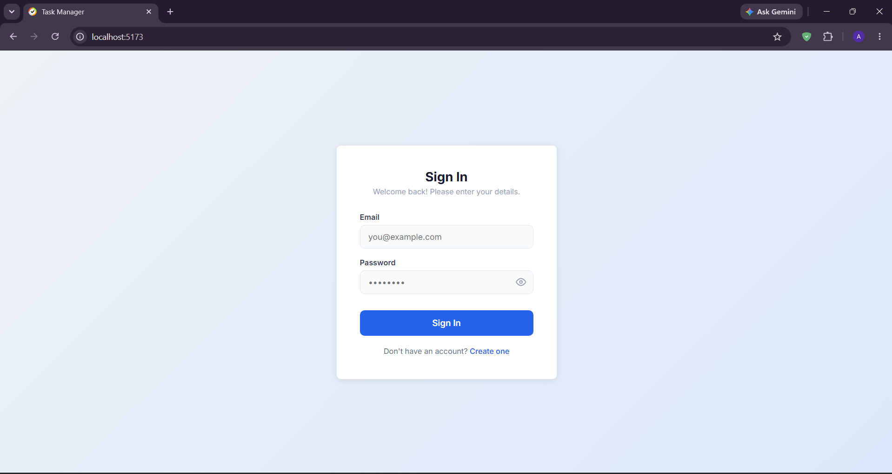
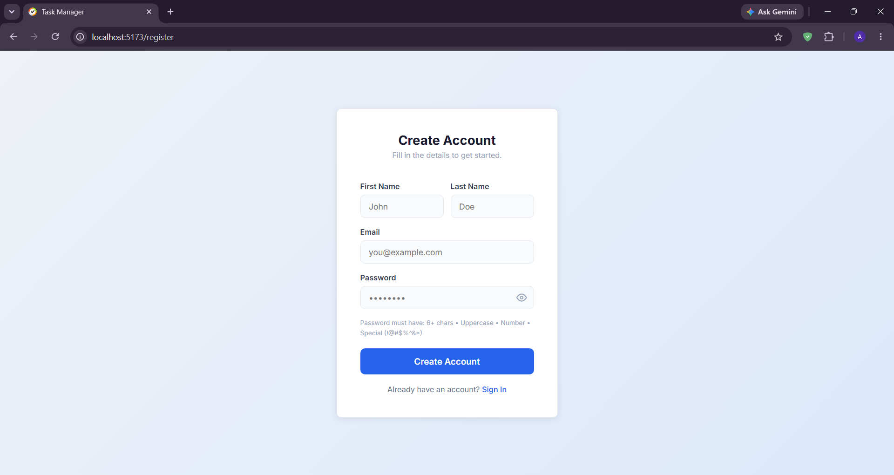
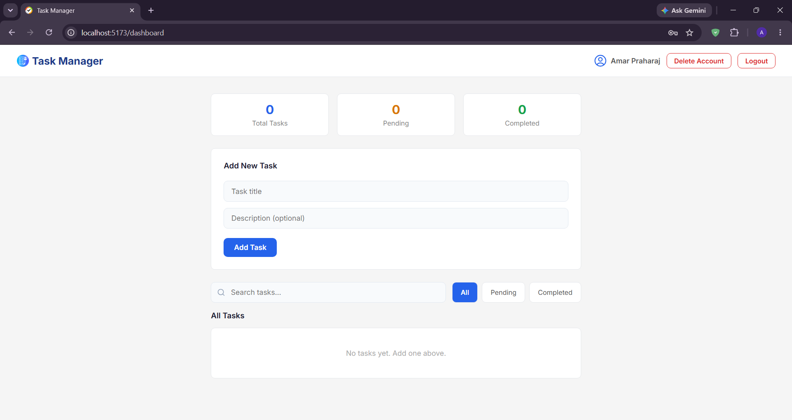

# Task Manager - MERN Stack App

A full-stack Task Management Web Application built using the MERN stack (MongoDB, Express.js, React.js, Node.js).

## Features
- User Registration & Login with JWT Authentication
- Create, Read, Update, Delete Tasks
- Mark tasks as Completed or Pending
- Search tasks by title
- Filter tasks by status (All, Pending, Completed)
- Pagination for task list
- Delete Account
- Responsive UI

## Tech Stack
**Frontend:** React.js, Axios, React Router DOM, React Hot Toast

**Backend:** Node.js, Express.js, MongoDB Atlas, JWT, bcryptjs

# Task Manager - MERN Stack App

A full-stack Task Management Web Application built using the MERN stack (MongoDB, Express.js, React.js, Node.js).

## Features
- User Registration & Login with JWT Authentication
- Create, Read, Update, Delete Tasks
- Mark tasks as Completed or Pending
- Search tasks by title
- Filter tasks by status (All, Pending, Completed)
- Pagination for task list
- Delete Account
- Responsive UI

## Tech Stack
**Frontend:** React.js, Axios, React Router DOM, React Hot Toast

**Backend:** Node.js, Express.js, MongoDB Atlas, JWT, bcryptjs

## Setup Instructions

### Backend
```bash
cd backend
npm install
node server.js
```

### Frontend
```bash
cd frontend
npm install
npm run dev
```

### .env file
MONGO_URI=your_mongodb_connection_string
JWT_SECRET=your_secret_key
PORT=5000

## Screenshots

### Login Page


### Register Page


### Dashboard


## API Endpoints
| Method | Endpoint | Description |
|--------|----------|-------------|
| POST | /api/auth/register | Register user |
| POST | /api/auth/login | Login user |
| DELETE | /api/auth/delete | Delete account |
| GET | /api/tasks | Get all tasks |
| POST | /api/tasks | Create task |
| PUT | /api/tasks/:id | Update task |
| DELETE | /api/tasks/:id | Delete task |
| PATCH | /api/tasks/:id/toggle | Toggle status |

## Developer
**Amar Praharaj** — MCA Student